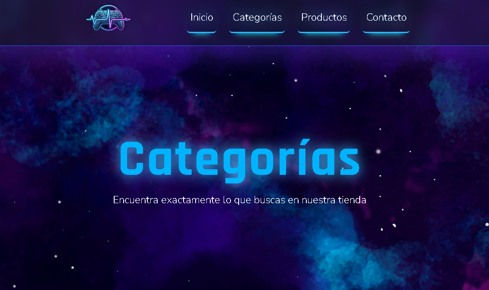
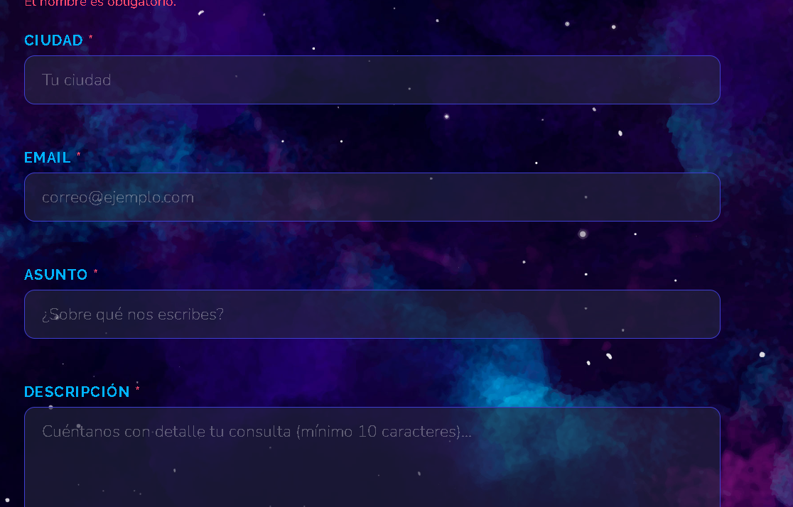

Nombre del proyecto: GamePulse
Integrantes: Sebastian Collaguazo, Alexis Changoluisa
Temática elegida: Tienda de videojuegos
Descripción del proyecto: 
Capturas de pantalla:

Enlace al sitio desplegado en GitHub Pages:  https://pucetec-prog2.github.io/actividad-final-integradora-CM-Sebastian/